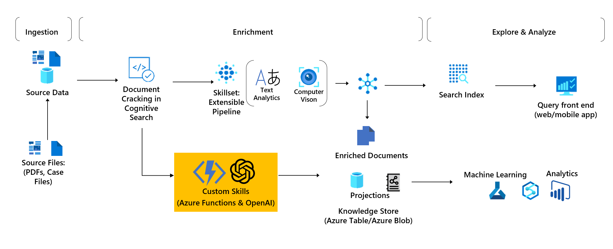

# OpenAI integration with Azure Cognitive-Search for document analysis
*Azure OpenAI integration as a custom skillset in Azure Cognitive Search*

## Why this integration?

OpenAI has revolutionized the way we develop applications by providing state-of-the-art machine learning models and making it easy for developers to add AI capabilities to their applications without needing to have an extensive background in data science. 

In addition, many of the OpenAI models are available on Azure, where you can get the security capabilities of Microsoft Azure while running the same models as OpenAI. Azure OpenAI offers private networking, regional availability, and responsible AI content filtering.

However, even if OpenAI APIs are very easy to use and integrate, you may have faced some of these limitations:

- **Format**: OpenAI only supports text or json format. If you want to analyze enterprise documents such as PDF, Word, PowerPoint, etc., you need to extract or transform your data.
- **Source**: You cannot directly connect OpenAI to data storages like a database, a SharePoint or a Data Lake.
- **Token limitation**: Depending on the model used, OpenAI requests can use up to 4097 tokens shared between prompt and completion. To analyze longer documents, the text needs to be spit into multiple pieces.

## What is the added value of using Azure Cognitive Search with OpenAI?

This is where Azure Cognitive Search comes as a great comes as a great complement to Azure OpenAI.

- **Data Integration**: Azure Cognitive Search has connectors to many Data Sources to simplify data ingestion into a search index.
- **Data transformation:** Transforms large undifferentiated file formats into into searchable text. Using the Optical Character Recognition skill, it can even process images.
- **Split text:** The Text Split skill breaks text into chunks of text. You can specify whether you want to break the text into sentences or into pages of a particular length. This skill is  useful for the maximum text length requirements in OpenAI. 
- **Translation capabilities:** The Text Translation skill evaluates text and returns the text translated to the specified target language. Microsoft Translation API supports more than 70 languages for text translation, while OpenAI has only limited support for a few other languages than English.

Azure OpenAI can offer additional AI enrichment to your Cognitive Search index such as:

- Document classification
- Document summarization
- New insights generation
- KPI extraction
- Etc.

In this example, we will add summarization capability to the Cognitive Search index using Azure OpenAI. 

## Requirements

To deploy this project you'll need:

- [Azure Cognitive Search](https://learn.microsoft.com/en-us/azure/search/) 
- [Azure OpenAI](https://learn.microsoft.com/en-us/azure/cognitive-services/openai/overview) 

- Python [Azure Functions](https://learn.microsoft.com/en-us/azure/azure-functions/functions-overview) 

For the development, it is recommended to use [Visual Studio Code](https://code.visualstudio.com/) and [Postman](https://www.postman.com/).

## Get started

- Update the [Azure Functions]((.\openai-custom-skill\openai_request\__init__.py)) with your own OpenAI prompt.
- Deploy the function to Azure.
